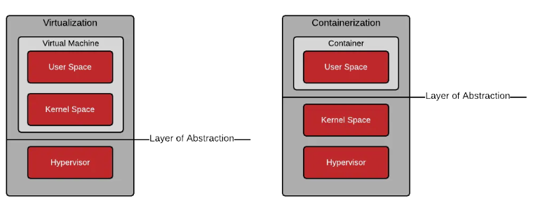

# Containers

## What are containers?

Software   applications  typically   depend   on   other   libraries,   configuration   files,   or
services that are provided by the runtime environment. 

Developers typically only share code or binaries (instead of sharing an entire virtual machine). Sharing an entire virtual machine with other developers can be inconvenient because of a virtual machine's size and format. Sharing only the code is advantageous in terms of size -  the disadvantage being that extra steps are required when deploying the software into a production environment. Developers often build on code that requires underlying modules (e.g. Ruby, PHP PECL, Python, Perl, etc). Some of these modules are provided as packages in the operating system, but often they are pulled from an external repository - some even need to be compiled from C/C++. Other developers, administrators, and architects are then left to figure out how to install these requirements. Tools like RPM, git, and RVM have been developed to make this easier... but the build and deployment steps can be complicated and often require some measure of expertise (outside the domain of the application being developed).

Neither the "code only" nor "full virtual machine" method of sharing is perfect.

One of the bigger pain points that has traditionally existed between development and
operations teams is how to make changes rapidly enough to support effective development but without risking the stability of the production environment and infrastructure. 

Containers make it easier for developers to develop an application in a container in their local environment and deploy that same container into production, minimizing risk and development overhead while also cutting down on the amount of deployment effort required of operations engineers.

Containers provide many of the same benefits as virtual machines, such as *security*, *storage*, and *network isolation*. Containers *require far fewer hardware resources and are quick to start and terminate*. They also *isolate the libraries and the runtime resources (such as CPU and storage) for an application* to minimize the impact of any OS update to the host OS.

Containers ares a set of one or more processes that are isolated from the rest of the system.

Containers help DevOps by enabling consistent and repeatable environments across development, testing, and production, which aligns development and operations teams by reducing configuration discrepancies and ensuring the application behaves the same way across all stages. This streamlines the CI/CD pipeline, accelerates deployment, and minimizes the risk of errors during transitions from development to production.

## Containers vs Virtual Machines


In a **virtual machine (VM)**, we need to install an operating system with the appropriate
device drivers; hence,the footprint or size of a virtual machine is huge. A normal VM with
Tomcat and Java installed may take up to 10 GB of drive space:
There's an overhead of memory management and device drivers. A VM has all the
components a normal physical machine has in terms of operation.

In a VM, the hypervisor abstracts resources. Its package includes not only the application,
but also the necessary binaries and libraries, and an entire guest operating system, for
example, CentOS 6.7 and Windows 2003.
Cloud service providers use a hypervisor to provide a standard runtime.

A **container** shares the operating system and device drivers of the host. Containers are
created from images, and for a container with Tomcat installed, the size is less than 500 MB:
Containers are small in size and hence effectively give faster and better performance.
They abstract the operating system.
A container runs as an isolated user space, with processes and filesystems in the user space
on the host operating system itself, and it shares the kernel with other containers. Sharing
and resource utilization are at their best in containers, and more resources are available due
to less overhead. It works with very few required resources.




`Linux kernel` is the core part of the Linux operating system. It's what originally Linus wrote.
`Linux OS` is a combination of the kernel and a user-land (libraries, GNU utilities, config files, etc).
`Linux distribution` is a particular version of the Linux operating system like Debian or CentOS.

<br>

`User space` refers to all of the code in an operating system that lives outside of the kernel. Most Unix-like operating systems (including Linux) come pre-packaged with all kinds of utilities, programming languages, and graphical tools - these are user space applications. We often refer to this as “userland.”

`Kernel space` is where the core of the operating system, the kernel, operates. The kernel is responsible for managing the system’s resources, such as the CPU, memory, and storage. It also provides system calls, which are interfaces that allow userspace applications to interact with the kernel.

<br>

A container is indeed just a `process` (or a bunch of processes) running on the Linux host. The container process `is isolated` (namespaces) from the rest of the system and `restricted from both the resource consumption` (cgroups) and security (capabilities, AppArmor, Seccomp) standpoints.

For those interested in the internals of the containers [this blog with 3 articles](https://www.redhat.com/en/blog/architecting-containers-part-1-why-understanding-user-space-vs-kernel-space-matters) from Scott McCarty is an extremely good read.

## Podman


"Podman is a daemonless, open source, Linux native tool designed to make it easy to find, run, build, share and deploy applications using Open Containers Initiative (OCI) Containers and Container Images. Podman provides a command line interface (CLI) familiar to anyone who has used the Docker Container Engine. Most users can simply alias Docker to Podman (alias docker=podman) without any problems. Similar to other common Container Engines (Docker, CRI-O, containerd), Podman relies on an OCI compliant Container Runtime (runc, crun, runv, etc) to interface with the operating system and create the running containers. This makes the running containers created by Podman nearly indistinguishable from those created by any other common container engine." - Podman docs

Podman does bring some nicer features compared to Docker: 

* Docker relies on a central daemon that manages containers, but Podman **doesn't require a background service running**
* **Rootless Containers**: Podman allows users to run containers as non-root users, enhancing security.
* **Docker Compatibility**: Podman aims to be a drop-in replacement for Docker, meaning it can often use the same commands and workflows.
* **Systemd integration**. Podman can generate systemd unit files that allow users to run containers as system services.
* Podman **can generate Kubernetes YAML files from existing container configurations**, which makes it easy to use Podman containers as part of a Kubernetes-based orchestration setup.

Bellow are some of the basic Podman commands a begginer should know:

```bash
# Verifiy if Podman is installed and check the version
podman version

# Build an image using instructions from Containerfiles
podman build 

# Run a command in a new container
podman run  

# Save image(s) to an archive
podman save 

# Load image(s) from a tar archive
podman load 

# List images in local storage
podman images

# List containers
podman ps 

# Run a process in a running container
podman exec

# Log in to a container registry
podman login
```

The `Open Container Initiative (OCI)` is a Linux Foundation project dedicated to managing specifications and projects related to the storage, distribution, and execution of container images. The OCI was formed in 2015 when developers recognized that the quickly growing container industry needed standards to ensure the portability of containers across systems and platforms.

The OCI currently manages three specifications: the `Runtime Specification`, the `Image Specification`, and the `Distribution Specification`. These specifications work together to ensure that any OCI-compliant image can be run on any OCI-compliant runtime, and that OCI-compliant registries (such as Docker, Amazon Elastic Container Registry, or Google Container Registry) are able to distribute OCI images according to OCI guidelines.

## Containerfile (definition) to Image (build) to Containers (running) 

A `Containerfile (Dockerfile)` is the Docker image’s source code. A Containerfile (Dockerfile) is a text file containing various instructions and configurations. The `FROM` command in a Containerfile (Dockerfile) identifies the base image from which you are constructing. An `image` is an immutable file that contains the source code, libraries, dependencies,
tools, and other files needed for an application to run. In a way images are templates used to
build a container. A `container` is, ultimately, just a running image.


## Writing Containerfiles (Dockerfiles)

A Containerfile (Dockerfile) is a text-based document that's used to create a container image. It provides instructions to the image builder on the commands to run, files to copy, startup command, and more.

Example:

```Dockerfile
FROM python:3.12

WORKDIR /usr/local/app

# Install the application dependencies
COPY requirements.txt ./
RUN pip install --no-cache-dir -r requirements.txt

# Copy in the source code
COPY src ./src
EXPOSE 5000

# Setup an app user so the container doesn't run as the root user
RUN useradd app
USER app

CMD ["uvicorn", "app.main:app", "--host", "0.0.0.0", "--port", "8080"]
```

For a complete guide check [Dockerfile Refference](https://docs.docker.com/reference/dockerfile/)

## Container Registries


An **image registry** is a centralized location for **storing and sharing** your container images. It can be either **public** or **private**. Docker Hub is a public registry that anyone can use and is the default registry.

While Docker Hub is a popular option, there are many other available container registries available today, including Amazon Elastic Container Registry(ECR), Azure Container Registry (ACR), and Google Container Registry (GCR). You can even run your private registry on your local system or inside your organization. For example, Harbor, JFrog Artifactory, GitLab Container registry etc.

To address a registry artifact for push and pull operations with Docker or other client tools, combine the fully qualified registry name, repository name (including namespace path if applicable), and an artifact tag or manifest digest. See previous sections for explanations of these terms.

Address by tag: `[loginServerUrl]/[repository][:tag]`

Address by digest: `[loginServerUrl]/[repository@sha256][:digest]`


We can also have namespaces within the image name. Those are optional sometimes may represent the user or organization. 
For example, in Dockerhub official images will be under `library` namespace such as `docker.io/library/ubuntu:latest`. If you are pushing images to docker hub then you will need to add your username as a namespace: `docker.io/johndoe/ubuntu:latest`.

Reading: [docker image tag (same applies to podman)](https://docs.docker.com/reference/cli/docker/image/tag/)

# Further Reading Materials 

* [IBM Introduction to containerization](https://www.ibm.com/think/topics/containerization)
* [Best practices for building containers](https://docs.docker.com/build/building/best-practices/)
* [A Practical Introduction to Docker Container Terminology](https://developers.redhat.com/blog/2016/01/13/a-practical-introduction-to-docker-container-terminology?utm_campaign=containers&intcmp=70160000000h1s6AAA&extIdCarryOver=true&sc_cid=701f2000001OH7EAAW#)
* [Write your first Containerfile for Podman](https://www.redhat.com/en/blog/write-your-first-containerfile-podman)
* [Base Images](https://docs.docker.com/build/building/base-images/)
* [Developing inside a container via VsCode](https://code.visualstudio.com/docs/devcontainers/containers)