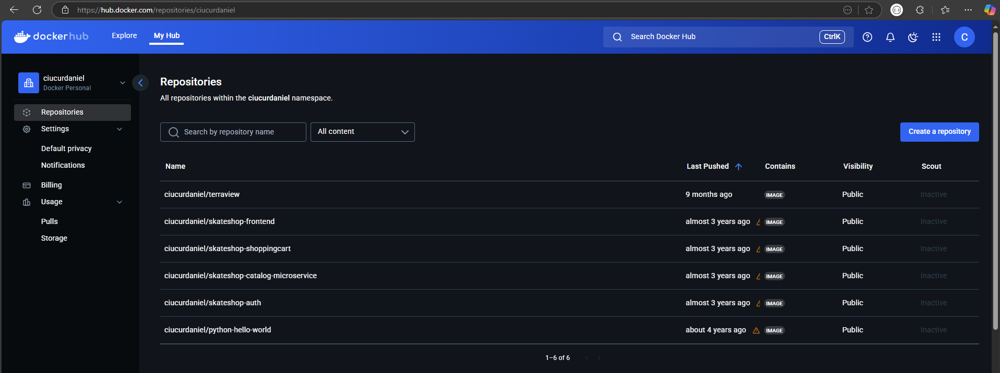

# Containers

## What are containers?

One of the bigger pain points that has traditionally existed between development and
operations teams is how to make changes rapidly enough to support effective development but without risking the stability of the production environment and infrastructure. 

A relatively new technology that helps alleviate some of this friction is the
idea of software containers — isolated structures that can be developed and deployed
relatively independently from the underlying operating system or hardware.

Similar to virtual machines, containers provide a way of sandboxing the code that
runs in them, but unlike virtual machines, they generally have less overhead and less
dependence on the operating system and hardware that support them. 

This makes it
easier for developers to develop an application in a container in their local environment and deploy that same container into production, minimizing risk and development overhead while also cutting down on the amount of deployment effort required
of operations engineers.


## Containers vs Virtual Machines


In a **virtual machine (VM)**, we need to install an operating system with the appropriate
device drivers; hence,the footprint or size of a virtual machine is huge. A normal VM with
Tomcat and Java installed may take up to 10 GB of drive space:
There's an overhead of memory management and device drivers. A VM has all the
components a normal physical machine has in terms of operation.

In a VM, the hypervisor abstracts resources. Its package includes not only the application,
but also the necessary binaries and libraries, and an entire guest operating system, for
example, CentOS 6.7 and Windows 2003.
Cloud service providers use a hypervisor to provide a standard runtime.

A **container** shares the operating system and device drivers of the host. Containers are
created from images, and for a container with Tomcat installed, the size is less than 500 MB:
Containers are small in size and hence effectively give faster and better performance.
They abstract the operating system.
A container runs as an isolated user space, with processes and filesystems in the user space
on the host operating system itself, and it shares the kernel with other containers. Sharing
and resource utilization are at their best in containers, and more resources are available due
to less overhead. It works with very few required resources.

## Podman


"Podman is a daemonless, open source, Linux native tool designed to make it easy to find, run, build, share and deploy applications using Open Containers Initiative (OCI) Containers and Container Images. Podman provides a command line interface (CLI) familiar to anyone who has used the Docker Container Engine. Most users can simply alias Docker to Podman (alias docker=podman) without any problems. Similar to other common Container Engines (Docker, CRI-O, containerd), Podman relies on an OCI compliant Container Runtime (runc, crun, runv, etc) to interface with the operating system and create the running containers. This makes the running containers created by Podman nearly indistinguishable from those created by any other common container engine." - Podman docs

Podman does bring some nicer features compared to Docker: 

* Docker relies on a central daemon that manages containers, but Podman doesn't require a background service running
* Rootless Containers: Podman allows users to run containers as non-root users, enhancing security.
* Docker Compatibility: Podman aims to be a drop-in replacement for Docker, meaning it can often use the same commands and workflows.
* Systemd integration. Podman can generate systemd unit files that allow users to run containers as system services.
* Podman can generate Kubernetes YAML files from existing container configurations, which makes it easy to use Podman containers as part of a Kubernetes-based orchestration setup.

Bellow are some of the basic Podman commands a begginer should know:

```bash
# Verifiy if Podman is installed and check the version
podman version

# Build an image using instructions from Containerfiles
podman build 

# Run a command in a new container
podman run  

# Save image(s) to an archive
podman save 

# Load image(s) from a tar archive
podman load 

# List images in local storage
podman images

# List containers
podman ps 

# Run a process in a running container
podman exec

# Log in to a container registry
podman login
```

## Containerfile (definition) to Image (build) to Containers (running) 

A Containerfile (Dockerfile) is the Docker image’s source code. A Containerfile (Dockerfile) is a text file containing various instructions and configurations. The `FROM` command in a Containerfile (Dockerfile) identifies the base image from which you are constructing.


## Writing Containerfiles (Dockerfiles)

A Containerfile (Dockerfile) is a text-based document that's used to create a container image. It provides instructions to the image builder on the commands to run, files to copy, startup command, and more.

Example:

```Dockerfile
FROM python:3.12

WORKDIR /usr/local/app

# Install the application dependencies
COPY requirements.txt ./
RUN pip install --no-cache-dir -r requirements.txt

# Copy in the source code
COPY src ./src
EXPOSE 5000

# Setup an app user so the container doesn't run as the root user
RUN useradd app
USER app

CMD ["uvicorn", "app.main:app", "--host", "0.0.0.0", "--port", "8080"]
```

For a complete guide check [Dockerfile Refference](https://docs.docker.com/reference/dockerfile/)

## Container Registries



An **image registry** is a centralized location for **storing and sharing** your container images. It can be either **public** or **private**. Docker Hub is a public registry that anyone can use and is the default registry.

While Docker Hub is a popular option, there are many other available container registries available today, including Amazon Elastic Container Registry(ECR), Azure Container Registry (ACR), and Google Container Registry (GCR). You can even run your private registry on your local system or inside your organization. For example, Harbor, JFrog Artifactory, GitLab Container registry etc.

To address a registry artifact for push and pull operations with Docker or other client tools, combine the fully qualified registry name, repository name (including namespace path if applicable), and an artifact tag or manifest digest. See previous sections for explanations of these terms.

Address by tag: `[loginServerUrl]/[repository][:tag]`

Address by digest: `[loginServerUrl]/[repository@sha256][:digest]`


We can also have namespaces within the image name. Those are optional sometimes may represent the user or organization. 
For example, in Dockerhub official images will be under `library` namespace such as `docker.io/library/ubuntu:latest`. If you are pushing images to docker hub then you will need to add your username as a namespace: `docker.io/johndoe/ubuntu:latest`.

Reading: [docker image tag (same applies to podman)](https://docs.docker.com/reference/cli/docker/image/tag/)

# Further Reading Materials 

* [IBM Introduction to containerization](https://www.ibm.com/think/topics/containerization)
* [Best practices for building containers](https://docs.docker.com/build/building/best-practices/)
* [Write your first Containerfile for Podman](https://www.redhat.com/en/blog/write-your-first-containerfile-podman)
* [Base Images](https://docs.docker.com/build/building/base-images/)
* [Developing inside a container via VsCode](https://code.visualstudio.com/docs/devcontainers/containers)