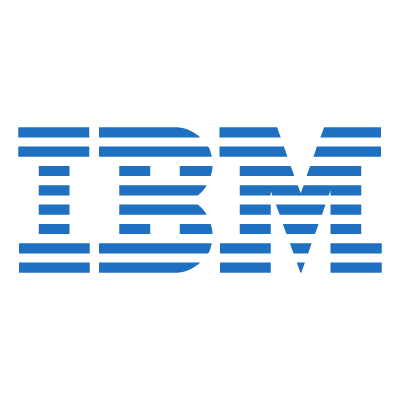

# IBM UVT Proiect Colectiv DevOps

This repository holds course materials for "Podman" course, part of `DevOps UVT Proiect Colectiv`. 

## Course Structure

* 1-introduction-to-containers-and-podman (teoretical section)
  * What are containers?
  * Containers vs Virtual Machines
  * Podman
  * Dockerfile (definition) to Image (build) to Containers (running) 
  * Writing Containerfiles (Dockerfiles)
  * Container Registries
  * Further Reading Materials 

* 2-hands-on-exercises (practical section)
  * Install Podman (Rokcylinux)
  * Create account on Dockerhub.com
  * Build an image
  * Tag an image
  * Pull an image from a public container registry
  * Push an image to a public container registry

* 3-container-orchestration (OPTIONAL: If we have time left)
  * What/Why?
  * Kubernetes and Openshift

## Repository structure

...
